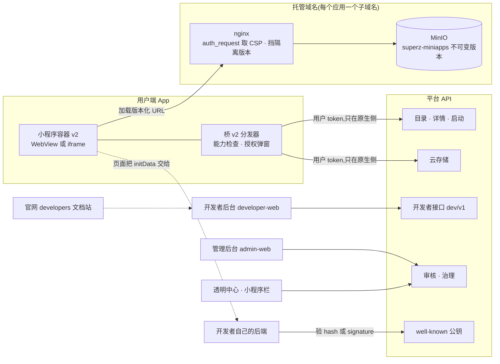

# 开发提示词 #320–#338:小程序开放平台(技术对标 Telegram Mini Apps)+ 首批官方小程序 / 小游戏

把 #277–#280(DEV-PROMPTS-31)那套「自家小程序」升级成**谁都能来开发的开放平台**:
开发者中心(门户 + 文档 + 后台)、平台托管、审核与治理、目录与发现,
并用平台自己的流程做出第一批官方小程序 —— **记事本**和小游戏 **2048**。

技术路线**对标 Telegram Mini Apps**:小程序就是普通网页,能力靠 JS SDK + 宿主桥给,
身份靠签名的 initData 传,不自研 DSL、不引商业容器。

## 怎么用这份文档

- §1–§8 是**设计与规范**,每条提示词都默认你读过它们。协议类的内容(§5)是规范性的:
  实现、文档、测试三处必须逐字一致;
- §9 是里程碑与依赖顺序;
- §10 的每一条 `#3xx` 是**一条可以单独交给编码 agent 的提示词**:背景、要做什么、
  落在哪些文件、验收标准、测试、明确不做。按 §9 的顺序一条一条来;
- §4 的「待拍板」**先定再做**。标了「推荐」的是我的建议,不是已定口径。

---

## 1. 现状与缺口(从代码里读出来的,不是印象)

已有(#277–#280、#292):

| 东西 | 位置 | 现状 |
|---|---|---|
| 清单表 `mini_apps` | 迁移 0104,`models.py` `MiniApp` | name/icon/tagline/entry_url/allowed_origins/perms/status(on/off)/sort,**没有归属开发者** |
| 清单接口 | `routers/mini_apps.py` | `GET /mini-apps`(要登录)、`POST /mini-apps/{id}/init-data`、四个 admin 接口(curl 可用,admin-web 没挂面板) |
| 身份协议 v1 | `services/mini_app.py` | canonical JSON 四字段 `app_id/auth_date/name/user_id` + **全平台一把** HMAC 密钥,时效 600s;测试锁 `tests/unit/test_mini_app_sign.py` |
| 桥 v1 | `server/static/mini-app-bridge.js`、`apps/user_app/lib/mini_app_*.dart` | 五个方法 `ready/close/expand/themeParams/getInitData`,Promise 风格;手机端原生 WebView 注入,web 端跨域 iframe + postMessage |
| 下拉面板 | `mini_apps_panel.dart`、`main.dart` `_onScrollForMiniApps` | **清单为空时整个手势不生效**(代码注释:没有内容的抽屉比没有抽屉更糟) |

**2026-09-12 在生产上核到的事实**:`mini_apps` 表 **0 条**。seed 里的两条自家条目
(透明中心、公开账本)只在本地库有,生产从没插过 —— 所以线上 App 下拉只会刷新,
拉不出小程序。这一条在 #337 里先修。

缺口(开放平台必须有、现在一样都没有):

1. **开发者**:没有开发者身份、认证、协议,清单只能 admin 用 curl 加;
2. **身份协议不适合第三方**:v1 用全平台一把密钥 —— 给了 A 开发者验签能力,
   就等于给了他伪造 B 小程序身份包的能力;v1 还把**全局 user_id** 交给页面,
   第三方之间可以串联同一个人;
3. **托管**:只能填外部 URL,审核看到的和上线跑的可以不是同一份代码;
4. **能力太少**:没有主按钮/返回键/触感/云存储/全屏,做不了记事本和游戏;
5. **治理**:没有审核流、驳回原因、申诉、举报、下架、公示;
6. **发现**:没有目录、搜索、详情页,官网拿不到清单(接口要登录);
7. **开发者体验**:没有文档、没有模拟器、没有真机调试路径。

---

## 2. 对标 Telegram:抄什么、不抄什么

| Telegram Mini Apps | 我们 | 阶段 / 理由 |
|---|---|---|
| 小程序 = 普通网页,`telegram-web-app.js` | 同,`sz-webapp.js`(SDK v2),API 命名尽量对齐 `Telegram.WebApp` | M0。降低迁移成本 |
| 启动参数放在 URL 片段 `#tgWebAppData=…`,页面**同步**拿到 | 同,`#szWebAppData=…` | M0。片段不进 HTTP 请求和 Referer |
| initData:HMAC-SHA256,密钥由 bot token 派生 | 同,密钥由**每个应用自己的 AppSecret** 派生 | M0。一应用一密钥 |
| 第三方验签:Ed25519 `signature` + Telegram 公钥 | 同,平台公钥公开发布(`/.well-known/`) | M0。**不持有密钥也能验**,和公开账本同一种信任观 |
| `user.id` 全局唯一 | **不抄**。给**按应用隔离**的 `open_id` | 防止第三方之间串联同一个人 |
| themeParams + `--tg-theme-*` CSS 变量 | 同,`--sz-theme-*` | M0 |
| MainButton / SecondaryButton / BackButton / SettingsButton | 同 | M0 |
| HapticFeedback | 同 | M0 |
| CloudStorage(1024 键 × 4096 字符) | 同,单值放宽到 64KB(记事本要用) | M0 |
| requestFullscreen / lockOrientation | 同,只给小游戏 | M0 |
| showPopup / showAlert / showConfirm | 同,原生弹窗 | M0 |
| showScanQrPopup / readTextFromClipboard / LocationManager / requestContact | 同,**敏感能力**:要申请 + 审核 + 用户逐次确认 | M3 |
| openInvoice / Telegram Stars | **不做**。支付不进小程序(DEV-PROMPTS-31 定死) | 见 §4 D8 |
| DeviceStorage / SecureStorage / BiometricManager / 传感器 | 不做。托管页是独立 origin,localStorage 本来就隔离 | 有真实需求再说 |
| 直达链接 `t.me/bot/app?startapp=` | `/m/<appid>?startapp=` | M2 |
| @BotFather | 开发者后台 developer-web | M2 |
| 测试环境(独立账号体系) | 模拟器 + 体验版 + `env=sim` 的 initData | M2 |
| 应用目录「热门」排行 | **不抄**。人工精选 + 公开的确定性排序,不做热度排行、不卖位置 | 不变量 I3 |
| Games 平台(sendGame / setGameScore) | 小游戏 = 同一套 Web 技术 + 全屏模式;排行榜后续,且标明「自报成绩」 | M1 / M3 |
| Bot(服务端给用户发消息) | 不做 bot 平台;通知订阅是 M3,要用户逐应用开 | 防骚扰 |

---

## 3. 不变量(先于功能定死;每条都要有守卫测试,守卫要先弄红一次)

- **I1 登录 token 永远不进 WebView。** 页面拿身份只有 initData 一条路(沿用 DEV-PROMPTS-31)。
  守卫:e2e 断言启动 URL、桥的每个应答里都不含 JWT 形状的串。
- **I2 默认只给 open_id。** 第三方默认拿不到手机号、真实姓名、全局 user_id、
  跨应用可关联的任何标识;昵称要用户同意(`requestProfile`),手机号是敏感能力。
  守卫:同一用户在两个应用拿到的 open_id 不同,且 open_id 与 user_id 无可计算关系(表映射、随机生成)。
- **I3 不卖位置、不做个性化推荐。** 目录排序是**一个纯函数**,只读公开字段
  (精选位次、首次上架时间、名称),规则写在文档和透明中心;**目录相关表里不允许出现
  bid / boost / paid / rank_score 这类字段** —— 和到店排队「往前挪的代码不存在」(`services/queue.py` 文件头)同一个做法。
  守卫:单测扫模型列名 + 排序函数的输入。
- **I4 审核看的就是上线的那一份。** 平台托管的版本**不可变**(对象只写一次,SHA-256 公示在详情页);
  上线 = 把「当前版本」指针指向一个已审核通过的不可变版本。
- **I5 每个处罚都有原因、都能申诉。** 驳回/下架/封禁必须带原因代码 + 面向开发者的说明;
  申诉必须由**另一名**审核员处理 —— 和三端的申诉通道同一条原则:一方能做的,另一方也能做;被处罚的一方永远有地方说理。
- **I6 支付不进小程序、这一批不接广告 SDK。** 桥里没有任何收集卡号/密码/支付的能力。
- **I7 敏感能力逐次确认。** 定位、扫码、剪贴板、手机号每次调用都弹原生确认
  (沿用 DEV-PROMPTS-31;是否放宽到「本次打开期间」见 §4 D7)。
- **I8 用户的数据用户说了算。** 用户随时能看某个小程序存了多少、导出、清空;
  注销账号级联删除全部小程序数据。开发者**不能**从服务端直接读用户的云存储。

---

## 4. 待拍板的决定(先定再做)

| # | 问题 | 推荐 | 代价 / 另一个选项 |
|---|---|---|---|
| D1 | 托管用什么域名 | **单独注册一个域名**专门托管第三方代码(每个应用一个子域名 `<appid>.<托管域名>`),和 chaojizan.cc 彻底分开 | 要买域名 + ICP 备案(1–3 周)+ 泛域名证书要走 DNS-01(现在 renew-cert.sh 是 HTTP-01 webroot)。用 chaojizan.cc 的子域名省事,但第三方页面能写 `.chaojizan.cc` 的 cookie、仿冒同源,风险落在主站 |
| D2 | 谁能入驻 | 个人(实名、18 岁以上)和企业(营业执照)都能入驻;**个人只能发不需要敏感能力的应用和单机小游戏** | 只开企业:更稳,但独立开发者进不来,和「谁都能开发」的目标拧着 |
| D3 | 自有域名模式(TG 那种任意 URL)开不开 | **第一阶段只开平台托管**;前端托管在我们这里,后端照样用开发者自己的服务器(声明「服务器域名」白名单)。自有域名 M3 再议、只给企业。`external` 只留给官方那两条存量条目(我们自己的域名),不对第三方开放 | 只有托管才能做到 I4;自有域名模式审核后内容随时能换 |
| D4 | 小游戏范围 | 第一批只上**免费、无内购、无广告、单机**的小游戏 | 带内购/广告的游戏涉及版号,等法务结论(见 #336) |
| D5 | 开发者注册是公开还是邀请 | 先**邀请制**(白名单手机号)跑一轮,审核能力验证过再公开 | 直接公开:审核队列可能一下子压垮 |
| D6 | 审核统计、下架记录上不上透明中心 | **上**:数量、驳回率、中位审核时长、下架记录(应用名 + 原因类别 + 申诉结果) | 不上:少一份被人盯着的压力,也少一份可信度 |
| D7 | 敏感能力授权粒度 | 定位类放宽到「本次打开期间有效」,扫码/剪贴板/手机号仍逐次确认 | 全部逐次确认:最保守,地图类应用会很烦 |
| D8 | 小程序里的支付 | **这一批不做**。以后要做的话走平台订单体系(开发者成为商家、按现有费率分账),不做「平台代收」 | TG 式虚拟币:和我们「账目为证」的路线不合 |
| D9 | 云存储是否端到端加密 | 第一版**服务端存储**,在小程序「关于」里写明「平台管理员在技术上能访问数据库」 | 端到端加密要用户自己保管口令,换设备就丢,等有需求再做可选项 |
| D10 | 要不要做 `Telegram.WebApp` 兼容垫片 | **不做垫片**,文档给一张 API 对照表 | 垫片能让 TG 代码零改动,但会让人以为我们和 Telegram 有关系 |
| D11 | 首批官方小程序名单 | 记事本 + 2048 必做;候选(本批不做):番茄钟、计算器、数独 | — |
| D12 | 发布是否收费 | 发布免费;第三方实名核验接口的调用费平台承担 | — |

---

## 5. 规范(规范性:实现、文档、测试逐字一致)

### 5.1 标识

- **AppID**:`sz` + 16 位小写十六进制,如 `sz8f3a2c1b9d4e7f06`。公开,可作 DNS 子域名。
- **AppSecret**:32 字节随机数,base64url 编码(43 字符)。**只在创建和重置时显示一次**;
  服务端 Fernet 加密落库(`services/crypto.py`),日志里永远不出现。
- **open_id**:`o_` + 26 位 base32(128 位随机数),存在映射表 `mini_app_openids(user_id, app_id)`。
  **用表不用哈希派生**:派生密钥一旦丢失或泄露,全部 open_id 同时失效或可被反推;表没有这个问题。
  同一个用户在同一个应用里永远是同一个 open_id,在不同应用里一定不同。

### 5.2 启动参数(URL 片段)

宿主打开小程序的地址形如:

```
https://<appid>.<托管域名>/v/<version_id>/index.html#szWebAppData=<initData 原串,URL 编码>
  &szWebAppVersion=2.0&szWebAppPlatform=android&szWebAppThemeParams=<JSON,URL 编码>
  &szWebAppStartParam=<start_param>
```

- 片段不进 HTTP 请求,也不进 Referer;
- SDK 在加载时同步读取,读完用 `history.replaceState` 抹掉片段,并存进 `sessionStorage`
  (页面在 WebView 里刷新仍可用;复制地址不会把身份包带出去)。

### 5.3 initData v2

initData 是一段 querystring,字段(除 `hash`、`signature` 外全部参与签名):

| 字段 | 类型 | 说明 |
|---|---|---|
| `app_id` | string | AppID |
| `auth_date` | int | 签发时间,unix 秒 |
| `launch_id` | string | 本次启动随机串(16 字节 base64url),开发者后端可据此防重放 |
| `user` | JSON 字符串 | `{"open_id":"o_…","language_code":"zh-CN"}`;用户同意过 `requestProfile` 的应用多 `nickname`、`avatar_url`。`requestProfile()` 同意后当场返回一份**新签发的** initData,后端照常验签 —— 页面自己报上来的昵称不可信 |
| `start_param` | string,可无 | 直达链接带来的参数,`[A-Za-z0-9_-]{1,64}` |
| `env` | string,可无 | 模拟器启动时为 `sim`,**开发者后端应据此区分测试流量** |
| `sig_kid` | string | 签名所用平台公钥的 id |
| `hash` | hex | HMAC,见下 |
| `signature` | base64url | Ed25519 签名,见下 |

计算方法(和 Telegram 一致,只换常量):

```
data_check_string = 除 hash、signature 外的字段,按键名字典序排序,
                    每个写成 key=value(value 为 URL 解码后的原文),用 \n 连接
secret_key = HMAC_SHA256(key = "SuperZWebAppData", msg = AppSecret)
hash       = hex(HMAC_SHA256(key = secret_key, msg = data_check_string))
signature  = base64url(Ed25519_sign(平台私钥[sig_kid], "<app_id>:SuperZWebAppData\n" + data_check_string))
```

- 验签二选一:持有 AppSecret 的后端验 `hash`;不想碰密钥的后端用平台公钥验 `signature`。
  平台公钥发布在 `GET /.well-known/superz-webapp-keys.json`:`[{kid, alg:"Ed25519", public_key, not_before, not_after}]`;
- **时效**:文档建议开发者后端拒绝 `auth_date` 超过 600 秒的包,并对 `launch_id` 做一次性校验;
- 比较用常量时间比较;字段缺失、`app_id` 不符、过期,一律同一种失败,不区分原因;
- **测试向量**:用固定的 AppSecret、固定的 Ed25519 私钥、固定的字段,算出固定的 `hash` 和 `signature`,
  写进单测和文档(同 docs/LEDGER-SPEC.md 的做法)。协议一旦有第三方接入就不能改。
- **v1 兼容**:`POST /mini-apps/{id}/init-data`(v1)保留给老版本 App 和老条目,文档标「已废弃」,
  `tests/unit/test_mini_app_sign.py` 一个字不改、继续锁 v1。

### 5.4 桥协议 v2

**传输**:手机端原生 WebView 的 `SuperzBridge` 通道(注入);web 端跨域 iframe + `postMessage`。
消息体:

```jsonc
// 页面 → 宿主
{"v":2, "type":"call", "id":17, "method":"CloudStorage.setItem", "params":{...}, "token":"<会话令牌>"}
// 宿主 → 页面
{"v":2, "type":"reply", "id":17, "ok":true, "data":{...}}
{"v":2, "type":"reply", "id":17, "ok":false, "error":{"code":4001, "message":"…"}}
{"v":2, "type":"event", "name":"themeChanged", "data":{...}}
```

- **会话令牌**:宿主每次注入时生成一次性随机串,只注入主框架;不带或带错令牌的消息一律丢弃。
  这是为了挡住**页面里嵌的第三方 iframe**:原生 JS 通道对页面内所有 frame 都可见,
  光校验主框架 URL 挡不住 iframe 冒充;
- web 端:宿主校验 `event.source === iframe.contentWindow` 且 `event.origin` 等于该应用的托管 origin;
- web 端的导航逃逸(#335 执行时补的):页面自己跳去别的站,父页面拦不住也读不到地址。宿主在 iframe 每次 load 后
  发 `{"v":2,"type":"ping","nonce":"…"}`(targetOrigin 写托管 origin,只有托管页收得到),SDK 回
  `{"v":2,"type":"pong","nonce":"…"}`;8 秒没回答就清空 iframe、报「页面跳到了这个小程序以外的地址」。
  所以托管的每个 HTML 页都要引 SDK;
- 宿主对每次调用都**当场**查能力(不是打开时查一次)。

**方法清单**(「能力」一列:basic = 所有应用都有;其余要在后台申请并审核通过):

| 方法 / 属性 | 能力 | 用户确认 | 对标 TG | 阶段 |
|---|---|---|---|---|
| `ready()`、`expand()`、`close()` | basic | — | 同名 | M0 |
| `initData`、`initDataUnsafe`、`version`、`platform`、`isVersionAtLeast(v)` | basic | — | 同名 | M0 |
| `colorScheme`、`themeParams`、`onEvent/offEvent` | basic | — | 同名 | M0 |
| `viewportHeight`、`viewportStableHeight`、`safeAreaInset`、`contentSafeAreaInset` | basic | — | 同名 | M0 |
| `setHeaderColor`、`setBackgroundColor`、`enable/disableClosingConfirmation` | basic | — | 同名 | M0 |
| `MainButton`、`SecondaryButton`、`BackButton`、`SettingsButton` | basic | — | 同名 | M0 |
| `HapticFeedback.impactOccurred/notificationOccurred/selectionChanged` | basic | — | 同名 | M0 |
| `showPopup`、`showAlert`、`showConfirm`(返回 Promise) | basic | — | 同名 | M0 |
| `openLink(url)`(系统浏览器,先弹「即将离开超级赞」) | basic | 离开确认 | 同名 | M0 |
| `share({text, url?})`(系统分享面板) | basic | 系统面板 | ≈ shareMessage | M0 |
| `CloudStorage.setItem/getItem/getItems/removeItem/removeItems/getKeys` | basic | — | 同名 | M0 |
| `requestFullscreen/exitFullscreen`、`lockOrientation/unlockOrientation` | 仅小游戏 | — | 同名 | M0 |
| `requestProfile()` → 昵称、头像 | profile | 首次确认,可在设置里撤回 | ≈ user 字段 | M2 |
| `getLocation({accuracy})` | location | 见 D7 | LocationManager | M3 |
| `showScanQrPopup()` | scanQr | 每次 | 同名 | M3 |
| `readTextFromClipboard()` | clipboard | 每次 | 同名 | M3 |
| `requestContact()` → 手机号 | phone(仅企业) | 每次 | 同名 | M3 |
| `openMiniApp(appid, startParam)` | basic | — | ≈ openTelegramLink | M3 |

**事件**:`themeChanged`、`viewportChanged`、`safeAreaChanged`、`contentSafeAreaChanged`、
`mainButtonClicked`、`secondaryButtonClicked`、`backButtonClicked`、`settingsButtonClicked`、
`popupClosed`、`activated`、`deactivated`、`fullscreenChanged`、`fullscreenFailed`。

**错误码**:

| 码 | 名称 | 含义 |
|---|---|---|
| 4001 | CAPABILITY_NOT_GRANTED | 应用没申请到这个能力 |
| 4002 | USER_DENIED | 用户点了拒绝 |
| 4003 | NOT_SUPPORTED | 宿主版本太老或当前平台没有(页面用 `isVersionAtLeast` 判断) |
| 4004 | INVALID_PARAMS | 参数不合法 |
| 4005 | RATE_LIMITED | 调用太频繁 |
| 4006 | QUOTA_EXCEEDED | 云存储配额满 |
| 4007 | REV_CONFLICT | 云存储写入时版本号不符(乐观并发) |
| 4008 | NOT_IN_HOST | 不在超级赞里打开 |
| 4009 | APP_SUSPENDED | 应用已被暂停,宿主随后会关闭它 |
| 5000 | INTERNAL | 宿主或平台内部错误 |
| 5001 | NETWORK | 网络失败,可重试 |

**CSS 变量**:`--sz-theme-bg-color`、`--sz-theme-secondary-bg-color`、`--sz-theme-text-color`、
`--sz-theme-hint-color`、`--sz-theme-link-color`、`--sz-theme-button-color`、`--sz-theme-button-text-color`、
`--sz-theme-accent-text-color`、`--sz-theme-destructive-text-color`、`--sz-theme-line-color`;
`--sz-viewport-height`、`--sz-viewport-stable-height`;`--sz-safe-area-inset-{top,bottom,left,right}`。
颜色取 brand.dart 产品层令牌(骨白/黏土/苔绿/赭…),亮暗两套。

### 5.5 云存储(CloudStorage)

- 作用域:(应用, 用户)。A 应用永远读不到 B 应用的数据;开发者服务端不能直读(I8);
- 键 `^[A-Za-z0-9_.:-]{1,128}$`;值为字符串,UTF-8 ≤ 65,536 字节;
- 配额:每个(应用, 用户)≤ 1024 个键、总计 ≤ 5 MB;
- 每个键带单调递增的 `rev`;`setItem(key, value, {ifRev})` 在 rev 不符时回 4007 —— 记事本靠它处理多端冲突;
- 批量:`getItems` 一次 ≤ 100 个键;`getKeys(prefix?)` 分页;
- 限流:每个(应用, 用户)每分钟 ≤ 120 次调用(批量算一次),超了回 4005;
- 用户在「设置 → 小程序授权与数据」里能看用量、导出 JSON、清空;注销账号级联删除;
  应用被永久移除后保留 30 天供用户导出,然后清除(这条写进开发者协议)。

### 5.6 托管包

- 上传物是 zip;应用 ≤ 10 MB、小游戏 ≤ 30 MB,单文件 ≤ 5 MB,文件数 ≤ 1000,解压总量 ≤ 3 倍压缩量(防 zip 炸弹);
- 根目录必须有 `index.html` 和 `superz.json`:

```json
{
  "sdk": "2",
  "kind": "app",
  "orientation": "portrait",
  "background_color": "#F0EEE6",
  "spa_fallback": false
}
```

- 扩展名白名单:html、js、mjs、css、json、txt、png、jpg、jpeg、gif、webp、svg、ico、woff、woff2、ttf、otf、
  mp3、ogg、wav、m4a、webm、mp4、wasm、map;拒绝符号链接、绝对路径、`..`(zip slip);
- 每个版本存成**不可变**对象:新桶 `superz-miniapps`,键 `<appid>/<version_id>/<path>`,只写一次;
- 返回头(由平台按应用生成,见 #322):

```
Content-Security-Policy: default-src 'self'; script-src 'self' 'wasm-unsafe-eval';
  style-src 'self' 'unsafe-inline'; img-src 'self' data: blob: <声明的域名>; font-src 'self' data:;
  media-src 'self' blob: <声明的域名>; connect-src 'self' <声明的服务器域名>; frame-src 'none';
  object-src 'none'; base-uri 'self'; form-action 'none';
  frame-ancestors <平台自己的 origin:web 版用户端、开发者后台的模拟器、管理后台的审核预览>;
  report-uri <平台>/mini-apps/csp-report
Permissions-Policy: camera=(), microphone=(), geolocation=(), payment=(), usb=(), bluetooth=()
X-Content-Type-Options: nosniff
Referrer-Policy: strict-origin-when-cross-origin
Cache-Control: public, max-age=31536000, immutable
```

  `Permissions-Policy` 把浏览器原生的相机/定位堵上,**敏感能力只能走桥**(有确认、有审计)。
- SDK 在每个托管 origin 下都有一份:`/_sdk/2/sz-webapp.js`(nginx 从平台静态目录出),
  所以 `script-src` 只需要 `'self'`,托管页不依赖主站域名;开发者也可以把 SDK 打进自己的包里。

### 5.7 直达链接

`https://chaojizan.cc/m/<appid>[?startapp=<[A-Za-z0-9_-]{1,64}>]`:
装了 App → 拉起 App 打开小程序;没装 → 官网详情页 + 下载引导。体验版用 `?v=trial`,只对体验者生效。

### 5.8 状态机(服务端强制,非法迁移抛错,照订单状态机 `state_machine.py` 的写法)

- **开发者**:`unverified → pending → verified | rejected`;`rejected → pending`(重新提交);
  `verified ⇄ suspended`;任意状态 → `closed`;
- **应用**:`draft →(首个版本发布)online ⇄ offline`(开发者自己下架/上架);
  `online → suspended`(平台处罚)`→ online`(整改后复审通过)或 `removed`(终态);
- **版本**:`uploaded →(可选)trial → reviewing → approved | rejected`;`reviewing → withdrawn`(开发者撤回);
  `approved → released`;发布新版本后旧版本 `released → superseded`;**回滚**只能指向状态为
  `released/superseded` 的版本;处罚时对象挪进隔离区(`quarantined` 标记);
- **能力申请**:`requested → approved | rejected`;`approved → revoked`。

### 5.9 驳回 / 处罚原因代码(文档和后台共用一张表)

| 码 | 原因 | 码 | 原因 |
|---|---|---|---|
| R101 | 打不开 / 核心功能不可用 | R301 | 隐私政策缺失或与实际不符 |
| R102 | 与名称、描述、截图不符 | R302 | 超出声明范围收集信息 |
| R103 | 空壳、测试页、半成品 | R303 | 未经同意获取敏感信息 |
| R201 | 违法违规内容 | R401 | 缺少类目要求的资质 |
| R202 | 色情低俗 | R402 | 游戏缺少版号 / 含内购或广告(本期不允许) |
| R203 | 赌博、彩票、博彩 | R501 | 仿冒平台界面、钓鱼 |
| R204 | 诱导分享、诱导关注、诱导下载 | R502 | 恶意代码、挖矿、刷量 |
| R205 | 虚假宣传、夸大功效 | R503 | 请求了未声明的服务器域名 |
| R206 | 侵害未成年人权益 | R601 | 商标、著作权侵权 |
| R207 | 引导站外交易 / 绕开平台规则 | R701 | 其他(必须写明具体说明) |

### 5.10 配额与限流(公开写进文档,和公示派单算法一个路子)

| 项 | 限额 |
|---|---|
| 每个开发者可创建的应用 | 个人 5 个、企业 50 个 |
| 每个应用的体验者 | 20 人 |
| 上传版本 | 每个应用每小时 30 次 |
| 启动(换 initData) | 每个用户每分钟 30 次 |
| 云存储 | 见 5.5 |
| 举报 | 每个用户每天 10 次 |
| 修改服务器域名 | 每个应用每月 50 次,改完只对新启动生效 |

---

## 6. 总体架构



**启动时序**:点图标 → 宿主 `POST /mini-apps/<appid>/launch` → 服务端校验(应用在线 / 用户是体验者)、
取或建 open_id、签 initData v2 → 返回版本化 URL + 能力清单 → 宿主显示启动页(图标、名称、「由 XX 提供」)
→ WebView 加载 → nginx 经 `auth_request` 查这个版本能不能出、拿到这个应用的 CSP → SDK 读片段 →
页面 `ready()` → 宿主撤掉启动页。

**发布时序**:开发者上传 zip → 校验 → 存不可变版本 → 设为体验版扫码真机看 → 提交审核
→ 审核员在模拟器和真机里过清单 → 通过 → 开发者点发布(或设置审核通过自动发布)→
当前版本指针切换 → 新启动拿到新版本;有问题一键回滚到任一已发布版本。

---

## 7. 数据模型(新迁移从 0124 起)

| 表 | 关键列 | 说明 |
|---|---|---|
| `developers` | user_id(唯一)、kind(individual/company)、display_name、status、real_name_enc、id_no_enc、company_name、uscc、license_key(私有桶)、contact_email、agreement_version、agreement_accepted_at、verified_at、reviewed_by | 个人真名/证号加密,**不公开**;企业名公开 |
| `mini_apps`(扩展) | + appid(唯一)、developer_id、kind(app/game)、category、description、screenshots、privacy_policy、data_declaration(jsonb)、hosting(hosted/external)、request_domains(jsonb)、current_version_id、secret_enc、secret_pending_enc、first_released_at、is_official;status 改为 draft/online/offline/suspended/removed | 旧行回填:appid 生成、developer = 官方开发者、hosting = external、on→online、off→offline |
| `mini_app_versions` | app_id、version、build(递增)、package_key、sha256、size、file_count、manifest、entry_url(external)、changelog、status、quarantined、submitted_at、reviewed_at、reviewed_by、reject_code、reject_note、released_at | 对象只写一次 |
| `mini_app_testers` | app_id、phone_pseudonym、phone_tail、added_at | 用 `crypto.pseudonym()` 匹配体验者的用户端账号,不存明文手机号 |
| `mini_app_capabilities` | app_id、capability、status、justification、decided_by、decided_at、note | |
| `mini_app_openids` | (user_id, app_id) 主键、open_id(唯一) | I2 |
| `mini_app_grants` | user_id、app_id、scope、granted_at、revoked_at | 持久授权(profile) |
| `mini_app_kv` | (app_id, user_id, key) 主键、value、bytes、rev、updated_at | |
| `mini_app_kv_usage` | (app_id, user_id) 主键、keys、bytes | 配额在同一事务里 `FOR UPDATE` 维护 |
| `mini_app_user_prefs` | user_id、app_id、starred、last_opened_at、open_count | 最近使用 / 我的小程序,多端同步 |
| `mini_app_decisions` | target_type、target_id、action、reason_code、note_public、note_internal、actor_id、appeal_of、created_at | 审核、处罚、申诉的全部记录;透明中心从这里投影 |
| `mini_app_reports` | app_id、reporter_user_id、reason_code、detail、evidence_keys、status、handled_by、resolution | |
| `mini_app_usage_daily` | app_id、day、opens、users | 给开发者看的聚合数;users < 10 时后台只显示「< 10」 |
| `mini_app_curation` | app_id、position、reason、added_by、added_at | 精选位;每次变动进规则留痕 |

用户角色枚举加 `developer`。**Postgres 的 `ALTER TYPE … ADD VALUE` 不能在事务块里跑**,迁移要用 autocommit 块。

---

## 8. 接口清单

| 对象 | 接口 |
|---|---|
| 公开(免登录) | `GET /mini-apps/catalog?kind&category&q&cursor`、`GET /mini-apps/<appid>`(详情 + 当前版本 SHA-256 + 能力 + 数据声明)、`GET /.well-known/superz-webapp-keys.json` |
| 用户 | `POST /mini-apps/<appid>/launch`、`GET /mini-apps/me`(最近 + 我的)、`POST/DELETE /mini-apps/<appid>/star`、`POST /mini-apps/<appid>/report`、`GET/DELETE /mini-apps/<appid>/data`(看用量、导出、清空)、`POST /mini-apps/<appid>/grants`、`DELETE /mini-apps/<appid>/grants/<scope>` |
| 宿主代页面调用 | `POST /mini-apps/<appid>/storage/{get,set,remove,keys,usage}`、`POST /mini-apps/<appid>/profile`(用户同意后) |
| 开发者 `/dev/v1` | 账号与认证、协议;应用增删改;版本上传/列表/设体验/提交/撤回/发布/回滚;体验者;能力申请;密钥(生成待生效 → 切换);服务器域名;数据;举报;审核记录与申诉 |
| 管理 `/admin/mini-apps` | 认证队列、审核队列(带版本差异)、能力审批、举报、处罚(暂停/恢复/移除/紧急隔离)、申诉(强制换人)、精选管理、统计 |
| nginx 内部 | `GET /internal/mini-host/check?host&uri` → 200 + `X-Sz-Csp` / 404(隔离或不存在) |
| 老客户端兼容 | `GET /mini-apps`(v1)**只返回 external 且兼容桥 v1 的条目** —— 老版本 App 跑不了托管应用,就别让它看见 |

---

## 9. 里程碑与顺序

```
M0 地基 ─ #337 第 1 步(先修生产空清单) → #320 数据模型 → #321 身份 v2 → #322 托管 → #323 SDK v2
          → #324 容器 v2 → #325 云存储
M1 首批 ─ #326 目录与发现(新版抽屉和目录要先有,用户才找得到托管应用)
          → #327 记事本、#328 2048(用官方开发者身份走一遍完整发布流程,吃自家狗粮)
M2 开放 ─ #329 开发者入驻 → #330 开发者后台 → #331 调试工具 → #332 审核治理
          → #333 文档站 → #334 透明中心 + 规则留痕
M3 增强 ─ 敏感能力(定位/扫码/剪贴板/手机号)、直达链接深化、通知订阅、自有域名模式、CLI、团队成员
贯穿   ─ #335 安全审计、#336 合规清单、#338 验证
```

M0/M1 做完就能在 App 里用上记事本和 2048;M2 做完才对外开放注册(D5 先邀请制)。

---

## 10. 提示词

### #320 数据模型与迁移

**背景**:§7 的表一张都没有;`mini_apps` 没有归属、没有版本。**要做**:

1. 迁移 0124 起:建 §7 全部新表,扩展 `mini_apps`,角色枚举加 `developer`(autocommit 块);
2. 回填:建一条「官方开发者」(企业,陕西爱卡斯科技有限公司,`is_official`),
   现有行生成 appid、挂到官方开发者、`hosting=external`、状态 on→online / off→offline;
3. 全部状态机写成 `services/miniapp_state.py`,照 `state_machine.py` 的 `assert_transition` 写法;
4. 代码里所有 `MiniApp.status == "on"` 的判断改成新状态(`grep` 之后**顺调用链核**,别只靠搜索结果下结论)。

**验收**:迁移在空库和生产结构的副本上 upgrade/downgrade 都通过;回填后旧接口行为不变;
非法状态迁移抛错。**测试**:状态机全迁移表单测;I3 守卫(扫目录相关模型列名,出现 bid/boost/paid/rank_score 就红);
v1 签名测试不动仍绿。**不做**:支付、广告相关的任何表或字段。

### #321 身份协议 v2

**背景**:v1 一把全局密钥 + 全局 user_id,不能给第三方(§1 缺口 2)。**要做**:

1. `services/mini_app_v2.py`:open_id 取或建(表映射,§5.1)、initData v2 签发与验签(§5.3,HMAC + Ed25519);
2. AppSecret:创建时生成、Fernet 加密;**两步轮换**:生成「待生效」密钥(只显示一次)→ 开发者部署 →
   点「切换」后才用新密钥签发;
3. 平台 Ed25519 私钥来自 `settings.mini_app_signing_key`(生产必须配置,开发环境从独立命名空间派生并在日志里警告);
   公钥端点 `/.well-known/superz-webapp-keys.json`,支持多个 kid 并存以便轮换;
4. `POST /mini-apps/<appid>/launch`:校验应用状态与体验者身份、限流(§5.10)、返回版本化 URL(§5.2)与能力清单;
5. 文档用的验签示例:Python、Node.js 两份**进 CI 跑测试向量**;Go、Java、PHP 三份标「未验证」。

**验收**:测试向量逐字节一致;同一用户两个应用 open_id 不同;篡改任一字段、换 app_id、过期,验签全部失败且错误信息相同;
轮换期间旧密钥签的包在切换后失效、新密钥签的包通过。**测试**:单测(向量、篡改、过期、轮换)+ e2e(登录 → launch → 用公钥和密钥各验一次)。
**不做**:改 v1 协议(一个字都不动)。

### #322 平台托管

**背景**:只能填外部 URL,做不到 I4。**要做**:

1. 上传 `POST /dev/v1/apps/<appid>/versions`(multipart):按 §5.6 逐条校验(大小、文件数、压缩比、扩展名、zip slip、符号链接、
   必须有 `index.html` 与 `superz.json`),产出**校验报告**(错误 + 警告,如引用了外部脚本);
   算整包 SHA-256 与逐文件清单;写入 `superz-miniapps` 桶,**同一键永不覆盖**;
2. nginx 托管站点(D1 定的域名):`server_name ~^(?<appid>sz[0-9a-f]{16})\.<托管域名>$`,
   只放行 `/v/<version_id>/…`;`auth_request` 到 `/internal/mini-host/check`,用 `auth_request_set` 取 `X-Sz-Csp`
   填进 `Content-Security-Policy`;检查结果按 (host, version) 缓存 30 秒;隔离或不存在的版本 404;
3. 开发环境没有 nginx:API 提供 `/_dev/mini-host/<appid>/<version_id>/<path>`,**返回头与生产一致**,e2e 用它;
4. 处罚隔离:对象挪到隔离前缀 + `quarantined=true`,检查端点立即 404;恢复则挪回;全程写 `mini_app_decisions`;
5. 基础设施前置(写进 #337):泛域名 DNS、泛域名证书(DNS-01)、ICP 备案、frps 转发不变(TCP 443 透传给本机 nginx)。

**验收**:恶意包(zip 炸弹、zip slip、符号链接、超限、缺清单)全部被拒且报告可读;
托管页请求未声明域名被 CSP 拦下并产生上报;隔离后同一 URL 立即 404。
**测试**:校验器单测每条规则一个用例;e2e 上传 → 启动 → 取 index.html 验返回头 → 隔离 → 404。
**不做**:服务端渲染、开发者自有服务器上的代码托管。

### #323 前端 SDK v2(`packages/miniapp-sdk/`)

**要做**:

1. TypeScript 源、零依赖;产物 `sz-webapp.js`(IIFE,挂 `window.SuperZ.WebApp`)、`sz-webapp.mjs`、`index.d.ts`;
2. 发布到 `server/static/sdk/2.x.y/sz-webapp.js`(不可变)+ `sdk/2/sz-webapp.js`(最新),文档给出 SRI(sha384);
   托管域名的 nginx 把每个应用 origin 下的 `/_sdk/` 指到同一目录(§5.6),托管页用同源地址引;
3. 实现 §5.4 全部 M0 方法、事件、错误码;读启动片段(§5.2);注入 CSS 变量;**所有方法返回 Promise**,
   同时兼容 TG 风格的回调参数;`isVersionAtLeast` 做宿主能力协商;
4. 两种通道(原生注入 / iframe postMessage)同一套 API;不在宿主里时 `inHost=false`,调用回 4008;
5. `?sz_mock=1` 本地调试模式:弹窗用浏览器原生、云存储落 localStorage、initData 带 `mock=1` 且**签名必然无效**
   (开发者后端照常验签就会拒绝,不会有人拿 mock 冒充真用户);
6. 继续提供 v1 的 `window.superz`(映射到 v2),老页面不用改。

**验收**:TS 类型完整;打包后 ≤ 12 KB(gzip);文档参考页的方法清单与 SDK 导出**自动比对一致**(脚本进 CI)。
**测试**:`node --test` + 假宿主覆盖每个方法的成功/失败/超时路径。**不做**:npm 发布(后续)、TG 兼容垫片(D10)。

### #324 用户端容器 v2(Flutter)

**背景**:现在是半屏弹层 + 五个方法,没有主按钮/返回键/全屏,也挡不住页面里嵌的 iframe 冒充。**要做**:

1. 桥分发器改成**能力注册表**:方法名 → 所需能力 → 是否要用户确认 → 处理函数;每次调用当场查能力;
2. **会话令牌**(§5.4)只注入主框架;web 端校验 source + origin;
3. 呈现:应用用半屏→全屏弹层(沿用 `mini_app_sheet.dart`);小游戏用**全屏路由**
   (沉浸式、按 `superz.json` 锁方向、安全区);
4. **顶栏归宿主,页面画不到**:图标、名称、「由 XX 提供」(已认证标记)、`···`(关于、分享、添加到我的小程序、投诉、重新进入、
   页面注册的设置项)、关闭;这是防仿冒的关键;
5. 原生渲染 MainButton / SecondaryButton(底栏)、BackButton(顶栏返回箭头 + 安卓系统返回);
   `enableClosingConfirmation` 时关闭前确认;
6. 原生弹窗(showPopup 最多 3 个按钮)、触感映射、主题与 CSS 变量下发、`themeChanged`/`viewportChanged`(键盘、拖拽结束)/安全区事件;
7. 启动页(图标、名称、开发者)、`ready()` 超时 8 秒后照常展示、错误页(重试 / 关闭)、离线提示;
8. 导航白名单:托管应用只许本应用的托管 origin;外链一律弹「即将离开超级赞」再交系统浏览器;禁止弹新窗口;
9. 授权弹窗组件(敏感能力 M3 用,M0 先把 profile 的首次确认做出来);
10. 「清除数据」:在应用 origin 里执行清 localStorage / IndexedDB,并调服务端清云存储;
11. 暂停处理:桥调用回 4009 时宿主关掉应用并提示「该小程序已被暂停」。

**验收**:iframe 冒充消息被丢弃(写一个恶意测试页验证);顶栏在任何页面内容下都可见且不可覆盖;
安卓系统返回键在 BackButton 可见时交给页面、不可见时关闭;小游戏全屏锁方向。
**测试**:分发器单测(能力、确认、拒绝、超时)、白名单单测、web 版 + puppeteer 走一遍、本机安卓模拟器与真机各走一遍(#338)。
**不做**:小程序间跳转、支付、通知(M3)。

### #325 云存储

**要做**:§5.5 全部:接口、配额(`mini_app_kv_usage` 同一事务 `FOR UPDATE`)、rev 乐观并发、限流(`ratelimit.check_rate_limit`)、
用量/导出/清空、注销级联删除、应用移除后 30 天清理(`auto_flow` 定时任务)。
**验收**:恰好到配额成功、多 1 字节失败;rev 冲突回 4007;A 应用读不到 B 应用;注销后数据为空。
**测试**:单测 + e2e 覆盖以上每条。**不做**:开发者服务端直读接口(I8)、端到端加密(D9)。

### #326 目录与发现

**要做**:

1. 公开目录与详情接口(§8);排序是 `services/miniapp_catalog.py` 里的**纯函数**:精选(按 position)在前,
   其余按 `first_released_at` 倒序(**不用 updated_at**,反复发版刷不上去);搜索按名称精确命中 > 前缀 > 包含,再按上架时间;
2. 下拉抽屉改成三段:最近使用(≤ 8)、我的小程序、「全部小程序 ›」;**只要目录不空就能下拉**(清单为空时手势不生效的规则保留);
3. 目录页:搜索、分类标签(工具、效率、生活、休闲游戏…)、列表(图标、名称、一句话、开发者);页脚写排序规则并链到规则页;
4. 详情页:打开、添加到我的、分享、投诉;开发者(认证类型)、版本、更新时间、**当前版本 SHA-256**、用到的能力、数据声明、隐私政策;
5. 「我的 → 设置 → 小程序授权与数据」:每个用过的小程序的授权项、云存储用量、导出、清空、移除;
6. 官网 `/miniapps` 公开目录页 + `/m/<appid>` 详情页(直达链接的兜底页);
   安卓 App Links:用户端 intent-filter(autoVerify)+ 官网 `/.well-known/assetlinks.json`
   (正式签名证书指纹见 docs/STORE-REVIEW.md),装了 App 的点链接直接拉起;
7. 老客户端兼容(§8 最后一行)。

**验收**:未登录能看目录;排序与文档描述一致(单测用文档里的例子);老版本 App 只看到它能打开的条目。
**测试**:排序纯函数单测 + I3 守卫、e2e(匿名目录、搜索、收藏、最近使用多端同步)。**不做**:热度榜、猜你喜欢、付费位。

### #327 官方小程序:记事本(`miniapps/notepad/`)

**定位**:最常用的小工具,也是开发者的**参考实现** —— 代码在开源仓里,文档逐段导读。

**功能**:

- 列表:置顶在前,其余按更新时间倒序;每条显示首行作标题、摘要、时间(今天 HH:mm / 昨天 / 日期);
- 新建:原生 MainButton「新建笔记」;编辑页全屏文本框,**首行即标题**,输入停 800ms 自动保存、离开时再存一次;
  显示字数,单条上限 20,000 字(到上限拦住并提示);
- 搜索(本地全文,高亮)、置顶、删除进回收站(保留 30 天,可恢复、可彻底删除)、分享(系统分享)、复制全文;
- 编辑页用 BackButton 返回列表;有未同步的改动时开启关闭确认;
- 空状态、离线提示、用量提示(已用 x / 5 MB)。

**数据与同步**:

- 云存储键 `n:<id>` → `{"v":1,"id","text","pinned","created_at","updated_at","deleted_at"}`;id 客户端生成、按时间可排序;
- **离线优先**:打开先读本地缓存秒开,再用 `getKeys('n:')` + `getItems`(每批 ≤ 100)对账;
- 写入带 `ifRev`;冲突(4007)时取回服务器版本,两边文本不同就**两份都留**:服务器版本不动,本地那份另存为
  「(冲突副本)原标题」并提示 —— 永远不丢字;
- 「关于」页如实写:数据存在超级赞云存储、按应用和用户隔离、开发者(这里是官方)不能从服务端读、
  平台管理员技术上能访问数据库、没有端到端加密(D9)。

**工程**:Vite + 原生 TypeScript,无框架;`scripts/build_miniapp.sh notepad` 产出**可复现**的 zip
(固定 mtime、条目排序),和线上详情页的 SHA-256 能对上;主题跟随宿主(亮暗);动效照 motion.dart 的时长曲线,尊重「减少动态效果」;
370–430px 宽为主,平板/web 限宽;字号用 rem,跟随系统字号。

**元数据**:名称「记事本」、图标「记」、分类「效率工具」、kind=app、能力:basic。

**验收**:增删改查、置顶、回收站、搜索、分享全部可用;断网改 → 联网自动同步;两台设备同时改同一条 → 出现冲突副本、内容不丢;
配额满时提示可读;gzip 后 ≤ 60 KB。**测试**:合并/冲突/上限的纯函数单测;web 版宿主 + puppeteer 走完整流程
(M1 时在线模拟器还没有;本地开发用 SDK 的 `?sz_mock=1`)。
**不做**:富文本、图片附件、协作共享、端到端加密。

### #328 官方小游戏:2048(`miniapps/2048/`)

**规则**:4×4;开局两块;每步在空格随机出 2(90%)或 4(10%);滑动合并,**每块每步最多合并一次**;
合并得分累加;拼出 2048 弹「你拼出了 2048」可继续;无路可走即结束。不做撤销。

**交互**:触摸滑动(阈值 24px,忽略斜向)、键盘方向键 / WASD(web);动画期间最多缓存 1 步输入。

**动效**(照动效规范):方块滑动 120ms standard;新方块 0.6→1 的 120ms;合并 1→1.12→1 的 spring;
开了「减少动态效果」全部直接到位。**触感**:合并出 ≥128 时 light;失败 warning;拼出 2048 success。

**存档**:云存储 `state`(棋盘、分数、随机种子、步数、是否已拼出)每步后防抖 500ms 保存;`best`(最高分、最大方块、局数);
本地缓存秒开、关了再开接着玩。随机数用**带种子的 PRNG**(可复现,方便测试)。

**视觉**:方块色阶取品牌色板(骨白 → 黏土 → 墨),数字对比度 ≥ 4.5:1;棋盘 `min(92vw, 420px)`;全屏、锁竖屏、避开安全区;等宽数字。

**诚实的边界**:没有广告、没有内购、没有排行榜 —— 前端游戏的分数没法由服务器验证,「关于」里写「成绩只存在你自己这里」。

**工程**:同 #327,Vite + 原生 TypeScript,DOM 方块 + CSS transform(16 个方块用不着 canvas,还便于无障碍读数);
游戏引擎写成与界面无关的纯函数模块;用 `scripts/build_miniapp.sh 2048` 出可复现 zip。

**元数据**:名称「2048」、分类「休闲益智」、kind=game、能力:basic + 全屏/锁方向。

**验收**:引擎规则全部正确;中端安卓机 60fps;关闭重开能续上。
**测试**:引擎单测(`[2,2,2,2]→[4,4,0,0]`、`[4,4,8,8]→[8,16,0,0]`、不重复合并、只在空格出块、无路可走判定、种子可复现);
web 版宿主里用键盘脚本打完一局。**不做**:排行榜、对战、音效。

### #329 开发者入驻与账号

**要做**:

1. `developer` 角色:developer-web 里手机号 + 短信登录注册(复用 `/auth` 的流程,role=developer);
2. 个人认证:姓名 + 身份证号走 `services/idcheck.py`(本地校验 + 配置后三方二要素),须满 18 岁;
   企业认证:营业执照上传私有桶 + OCR 预填(`licenses.py`)+ 统一社会信用代码,人工审核;
3. 开发者协议与平台规则走**规则留痕**:`services/rules.py` 的 AUDIENCES 加 `developer`,接受记录版本号;大改版要求重新接受,未接受前不能提交审核;
4. 权限:未认证可以建应用、传开发版、加体验者、用模拟器;**认证通过才能提交审核**;
5. 公开展示:企业显示公司名;个人显示自取的开发者名 +「个人开发者 · 已实名」,真名不公开;
6. 邀请制开关(D5)走 `PlatformFlag`。

**验收**:认证全流程(通过/驳回/重新提交)可走通;身份证号只存密文,接口只回尾号。
**测试**:e2e + `e2e_authz_regression` 加一关:developer 调不了商家/管理接口,顾客调不了 `/dev/v1`。
**不做**:团队成员与角色(M3)、开发者之间转让应用。

### #330 开发者后台 developer-web

**技术栈**:和 merchant-web、admin-web 一致 —— React 18 + Vite + TypeScript + Ant Design + react-router;
构建进 `server/static/dev`,挂在 `/dev/`(和 API 同源,不用配 CORS)。

**页面**:登录 / 注册 → 入驻认证 → 应用列表 → 应用详情(概览、基本信息、版本管理、开发设置、能力、体验者、数据、反馈、审核记录)
→ 消息(审核结果、规则变更、处罚通知)→ 账号。

- **版本管理**:拖拽上传(进度 + 校验报告)、版本列表(状态、SHA-256、大小)、设为体验版(出二维码)、提交审核(填更新说明和给审核员的测试说明)、
  撤回、发布(或「审核通过后自动发布」开关)、回滚;
- **开发设置**:AppID、AppSecret 两步轮换、服务器域名(只许 https、不许 IP 和 localhost,月度次数限制)、托管方式;
- **数据**:每日打开次数、用户数(< 10 显示「< 10」);
- **审核记录**:每条结论 + 原因代码 + 说明,「申诉」按钮(每个结论一次,7 天内)。

**验收**:从注册到发布的全流程能在后台里点完;`tsc --noEmit` 通过。**测试**:接口 e2e 全覆盖;puppeteer 冒烟(注入开发者 token 登录)。
**不做**:团队协作、账单(发布免费)。

### #331 调试工具

1. **在线模拟器**(developer-web 里):设备外框(390×844、360×800、平板)内嵌 iframe 加载开发版/体验版;
   控制台页面实现一个**模拟宿主**(和 web 宿主同一套 postMessage 协议):真签名的 initData(`env=sim`,用开发者自己的测试身份)、
   亮暗切换、视口/安全区调整、平台切换、触发返回键、渲染主按钮和弹窗;侧栏实时显示**桥调用日志**和 CSP 违规;
   模拟器里的云存储走独立命名空间,不污染真实数据;
2. **真机调试**:体验版二维码(`/m/<appid>?v=trial`)→ 用手机扫 → 已登录且是体验者就打开体验版;
   「我的 → 设置 → 开发者选项」(只对体验者显示)开「小程序调试」后:安卓开 `WebView.setWebContentsDebuggingEnabled`
   (电脑 `chrome://inspect`)、iOS 设 `isInspectable`;同时宿主可以浮出一个桥调用日志面板;
3. **不做本地地址直连**:安卓禁明文 http、内网 https 证书不被信任 —— 文档写清楚,用模拟器 + 快速上传开发版代替。

**验收**:开发者不装任何东西就能在浏览器里跑通 initData 验签(拿模拟器发出的包去自己后端验)。

### #332 审核与治理(admin-web)

**要做**:admin-web 新增页面:开发者认证、应用审核、能力审批、举报、处罚、申诉、精选、统计。

1. **审核队列**:显示与上一个通过版本的**差异**(文件清单、`superz.json`、服务器域名、能力变化);内嵌模拟器预览 + 真机预览二维码;
   审核清单(结构化表单,逐项通过/不通过 + 备注,清单本身有版本号);结论只能是通过 / 驳回(必选 §5.9 原因码 + 面向开发者的说明);
2. **处罚**:暂停(可恢复)、移除(终态)、**紧急隔离**(立即 404 + 已打开的会话在下一次桥调用时被关闭);全部写 `mini_app_decisions` 和 `admin_audit`;
3. **申诉**:7 天内一次;**系统强制分配给另一名审核员**(处理人等于原结论人时接口拒绝);结果回写并通知开发者;
4. **举报**:用户在容器 `···` 和详情页可举报(原因码 + 说明 + 截图);按应用聚合,达到阈值自动进复审;
5. 审核时效不承诺具体时限(同商家入驻),统计照实公示(D6)。

**验收**:非法状态迁移、自己复审自己的申诉、没有原因码的处罚,接口全部拒绝。**测试**:状态机 + 权限 + 申诉换人的 e2e,守卫先弄红再修绿。

### #333 开发者文档站(`docs/miniapp/` → 官网 `/developers`)

**源**:仓库里的 Markdown(和代码一起评审、一起留痕),构建时转成页面放进官网(`web/`),侧栏导航、站内搜索、「在 GitHub 上编辑」。

**开发者中心首页 `/developers`**:平台是什么、三步上手、四个入口(文档、开发者后台 `/dev/`、示例源码、审核与运营规范)、
平台数据(取透明中心那一栏,不另算);官网页脚和开源仓页各加一个入口。

**模板**:`miniapps/_template/` —— 最小可运行的 hello world(ready、主题变量、主按钮、initData 发给自己后端验签的示例),快速开始用它。

**目录**(每页的必写内容):

1. **概览**:平台是什么、为什么是普通 Web 技术、原则(§3 的不变量用大白话说)、能做与不能做、费用(免费);
2. **快速开始**:注册 → 建应用 → 下载模板(`miniapps/_template/`)→ 模拟器 → 上传开发版 → 扫码真机 → 提交审核 → 发布,十分钟跑通;
3. **核心概念**:AppID / AppSecret、open_id、initData、托管、版本(开发/体验/正式)、能力与授权、配额;
4. **SDK 参考**:每个方法:签名、参数、返回、错误码、所需能力、最低宿主版本、平台差异、示例;事件、CSS 变量;
5. **服务端**:initData 验签(hash 与 signature 两法、五种语言示例、测试向量)、会话建议、密钥轮换;
6. **云存储**:模型、配额、rev 并发、数据删除规则;
7. **设计规范**:主题变量、字体、安全区、主按钮用法、深浅色、无障碍、动效(链到品牌物料页的动效一栏);
8. **小游戏**:全屏与方向、性能预算、存档、音频自动播放限制、为什么没有排行榜、本期不允许内购和广告;
9. **审核规范**:允许与禁止的内容、隐私要求、资质与类目、§5.9 原因码逐条解释和正反例、审核流程、申诉;
10. **运营规范**:排序规则(不卖位置)、精选怎么选、下架与处罚、举报处理、公示;
11. **开发者协议、隐私要求模板**(法务定稿前标「草案」);
12. **更新日志与兼容表**(宿主版本 × 能力);
13. **故障排查**:白屏、CSP 拦截、验签失败、时钟偏差、4001/4007 怎么处理;
14. **示例导读**:记事本、2048 源码逐段讲;
15. **从 Telegram Mini Apps 迁移**:API 对照表(§2)。

**纪律**:文档里的每段示例代码要么有测试跑过,要么标「未验证」(同 #38);CI 跑内部链接检查和「SDK 导出 ⇄ 参考页」一致性检查;
业务口径链到透明中心,不另抄一份。

### #334 透明中心「小程序」栏 + 规则留痕

1. 透明中心新一栏:已认证开发者数、在线应用数(应用/游戏)、本月提交/通过/驳回数、中位审核时长、
   下架记录(日期、应用名、原因类别、是否申诉及结果)、精选名单及每次变动的理由、排序规则(链到代码里的纯函数);
2. 开发者规则进规则留痕(`/rules/developer/revisions`),开源仓页的「规则变更留痕」时间线加「开发者」标签;
3. **不公开**:个人开发者的真实姓名、举报人身份、内部审核备注。

### #335 安全审计(一条提示词,逐项验证,每项先证明守卫会响)

| 项 | 怎么验 | 期望 |
|---|---|---|
| token 隔离 | 启动 URL、全部桥应答、托管页可见的一切里搜 JWT 形状的串 | 没有 |
| iframe 冒充桥 | 托管页里嵌一个恶意 iframe 调桥 | 被丢弃 |
| 导航逃逸 | 托管页 302 到别的域 | 不在容器内加载,弹离开确认 |
| CSP | 请求未声明域名、内联注入外部脚本 | 被拦并上报 |
| 包校验 | zip 炸弹、zip slip、符号链接、超限 | 被拒 |
| 存储型 XSS | 名称/描述/更新说明里放脚本,在 App、后台、官网各渲染一次 | 全部转义 |
| IDOR | A 开发者操作 B 的应用、版本、密钥、体验者 | 拒绝 |
| open_id 不可关联 | 同一用户两个应用 | 不同,且无法从 open_id 推出 user_id |
| 重放 | 同一 initData 重复用 | 文档要求开发者用 launch_id 挡;平台侧的 launch 接口限流生效 |
| 密钥 | 日志、错误信息、响应里出现 AppSecret | 没有 |
| 云存储隔离与配额 | 跨应用读写、刷满配额、刷限流 | 拒绝 / 4006 / 4005 |
| 隔离即时生效 | 紧急隔离后访问版本 URL | 立即 404 |
| 点击劫持 | 别的站点 iframe 托管页 | `frame-ancestors` 拦下 |
| Host 头伪造 | 非法 appid 子域名、带端口、大小写变体 | 严格正则拒绝 |
| 缓存投毒 | auth_request 缓存键 | 含 host + version |
| 日志卫生 | 调用日志 | 不记请求体(同 #38) |

### #336 合规清单(需要法务确认,这里不下结论)

- **小程序备案**:工信部 2023 年起要求 App 与小程序备案;我们自建平台上的第三方小程序谁来报、怎么报,上线前确认;
  托管域名本身的 ICP 备案(D1);
- **个人信息保护**:平台与开发者是各自独立的处理者;每个应用必须有隐私政策和数据声明;未满 14 岁用户的规则;
- **小游戏**:带内购或广告的游戏的版号要求、防沉迷义务;第一批只上免费单机(D4);
- **内容安全**:含用户发布内容的小程序要有审核与举报,平台的处置时限;
- **日志留存**:平台访问日志的留存期限要求;
- 开发者协议、平台规则、隐私要求模板由法务定稿,文档里在那之前一律标「草案」。

### #337 上线顺序与生产数据

1. **先修现在的问题**(不等 v2):在生产插入官方开发者和两条自家条目(透明中心 `/transparency`、公开账本 `/nodes`,external、桥 v1 兼容),
   做成幂等脚本 `server/scripts/seed_official_miniapps.py`,部署后跑一次 —— 老版本 App 立刻就能下拉出小程序;
   改生产数据前**先征得同意**;
2. 基础设施:D1 域名 + 备案 + 泛域名 DNS + DNS-01 证书、`superz-miniapps` 桶、托管 nginx 站点、Ed25519 签名密钥(写进 `.env.prod`,并做离线备份);
3. 顺序:服务端(迁移 + 新接口,老接口行为不变)→ 新 App(容器 v2)→ 上传记事本和 2048(老 App 看不到托管应用,见 §8)
   → 邀请制开放开发者注册 → 公开;
   M1 时开发者后台还没有:官方应用用 `server/scripts/publish_official_miniapp.py <zip>` 上传,**走同一个校验器**,
   审核记录照写(审核人 = 管理员,标注「官方应用」),不开后门;
4. 开关全部走 `PlatformFlag`:托管应用、目录 v2、开发者注册、各敏感能力;任何一步出问题先关开关;
5. 回滚:应用级一键回滚版本;平台级关开关;迁移都有 downgrade。

### #338 验证

- 服务端单测(协议向量、状态机、配额、排序、I3 守卫)+ 新 e2e:`e2e_miniapp_identity.py`、`e2e_miniapp_hosting.py`、
  `e2e_miniapp_storage.py`、`e2e_miniapp_dev.py`、`e2e_miniapp_review.py`、`e2e_miniapp_catalog.py`,**查退出码,不只看 tail**;
- SDK:`node --test`;文档:链接检查 + SDK 一致性检查 + 验签示例跑向量;
- `make analyze`(三端 + packages/shared + Dart 单测 + tsc);安全扫描;
- web 版 + puppeteer:模拟器里跑记事本全流程、2048 键盘打一局;
- **安卓模拟器**(本机那台 Pixel 7 / Android 16)和**真机**各走一遍:下拉抽屉 → 目录 → 打开记事本 → 离线编辑 → 联网同步 →
  打开 2048 全屏 → 系统返回键 → 关闭;下拉刷新仍正常(DEV-PROMPTS-31 欠的真机手感验收一起还掉)。

---

## 11. 纪律

- 每个新接口配 e2e;公平性、安全性的断言**先弄红再修绿**,写完把守卫破坏一次确认它真会响;
- 协议(§5.3、§5.4)的实现、文档、测试向量三处逐字一致,改一处必须三处一起改;
- 文档示例要么有测试跑过,要么标「未验证」;
- 不静默改用户数据;改生产数据先征得同意;
- 全程不要 push。

## 12. 完成的标志

1. M0 + M1:用户在 App 里下拉就能打开记事本和 2048,两者的 SHA-256 与开源仓构建产物一致;
2. M2:一个陌生开发者只看文档,就能注册、认证、做出一个应用、在模拟器和真机里调通验签、提交审核并上线;
3. §3 每条不变量都有守卫测试,且每个守卫被证明会响;
4. §10 #335 的每一项都有验证记录;
5. 透明中心能看到小程序的审核统计和下架记录;
6. 全套 e2e、单测、analyze、安全扫描全绿。
